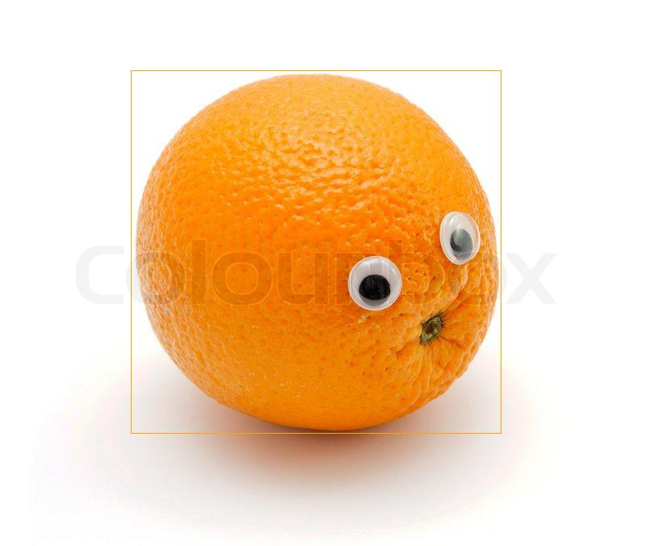

# Fruit Detection using Faster R-CNNs
Using Pytorch to create multiple Faster R-CNN models to detect images of fruit.

## Modified Faster R-CNN model
I modified PyTorch's torchvision Faster R-CNN class to both give losses and predictions while in eval() mode to allow ease of access to calculate the training loss.
My modified torchvision repository is [HERE](https://github.com/Coldestadam/vision_)

These are the files I modified:
1. [generalized_rcnn.py](https://github.com/Coldestadam/vision_/blob/master/torchvision/models/detection/generalized_rcnn.py)
2. [roi_heads.py](https://github.com/Coldestadam/vision_/blob/master/torchvision/models/detection/roi_heads.py)
3. [rpn.py](https://github.com/Coldestadam/vision_/blob/master/torchvision/models/detection/rpn.py)

## Methods
I chose to learn more about other optimization algorithms and I followed the advice of this article named [*Optimization Algorithms in Deep Learning*](https://towardsdatascience.com/optimization-algorithms-in-deep-learning-191bfc2737a4). The writer states that the [Adam Optimizer](https://en.wikipedia.org/wiki/Stochastic_gradient_descent#Adam) is the best algorithm for its ability to both use momentum and scaling to mix the algorithms of SGD + momentum and RMS Prop.

I used the writers advice to define the hyperparameters:
- B1 = 0.9
- B2 = 0.999
- Learning Rate = 0.001–0.0001

## Samples

Here is a sample of my Faster R-CNN model predicting the correct location and class of the orange.

[Please click here to see my 10 sample images.](samples)

## Results:
I was not able to get the best results due to lack of resources, but I was able to implement the algorithm which was my goal. Thank you for checking this out!
